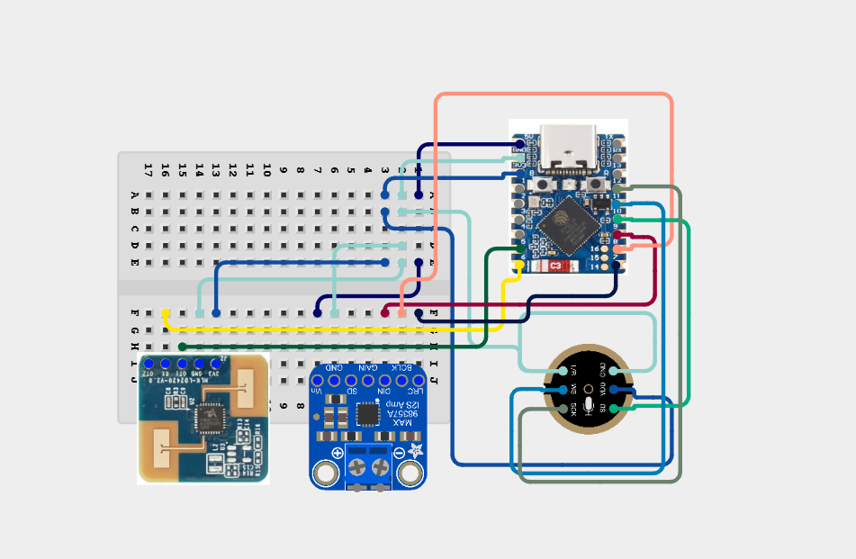

## Persist
A little presence detection and voice assistant device  powered by esphome  

## Parts Used 
1. [Hi-Link HLK-LD2420](https://robu.in/product/hlk-ld2420-24ghz-human-body-micro-motion-sensing-detection-radar-sensor-module-hlk-ld2410-low-cost-solution/)
2. [ESP32-S3-Zero](https://robu.in/product/waveshare-esp32-s3-mini-development-board-based-on-esp32-s3fh4r2-dual-core-processor-240mhz-running-frequency-2-4ghz-wi-fi-bluetooth-5/)
3. [INMP441 MEMS I2S Microphone](https://robu.in/product/inmp441-mems-high-precision-omnidirectional-microphone-module-i2s/)
4. [Adafruit MAX98357A I2S Amplifer](https://robu.in/product/adafruit-max98357a-i2s-3w-class-d-amplifier-breakout-board/)
5. [5 x 7 cm Universal PCB Prototype Board](https://robu.in/product/57-cm-universal-pcb-prototype-board-double-sided/)
6. [Female](https://robu.in/product/short-headers-kit-for-feather-12-pin-16-pin-female-headers/) and [Male](https://robu.in/product/2-54mm-1x40-pin-male-single-row-straight-long-header-strip-pack-of-3/) Header pins 
7. Speaker harvested from an old phone 

 ## Circuit schematic diagram
 
 

  

 | Protocol | ESP32 | INMP441 | MAX98357A | LD2420 | 
|:--------:|:-----:|:-------:|:-----------:|:------:|
| Power  | 5V   | - | VIN |   -  |
|        | 3.3V | VDD   |     | 3v3 |
|        | GND  |GND,L/R| GND | GND |
|Uart    |GPIO5 | - | - | OT1(TX)|
|        |GPIO6 | - | - | RX |
| I2S    |GPIO7 | - | LRC | - |
|       | GPIO8 | - | BCLK| - |
|       | GPIO9 | - | DIN | - |
|       | GPIO10 | SD | - | - |
|       | GPIO11 | WS | - | - |
|       | GPIO12 |SCK  | -| - |
     
